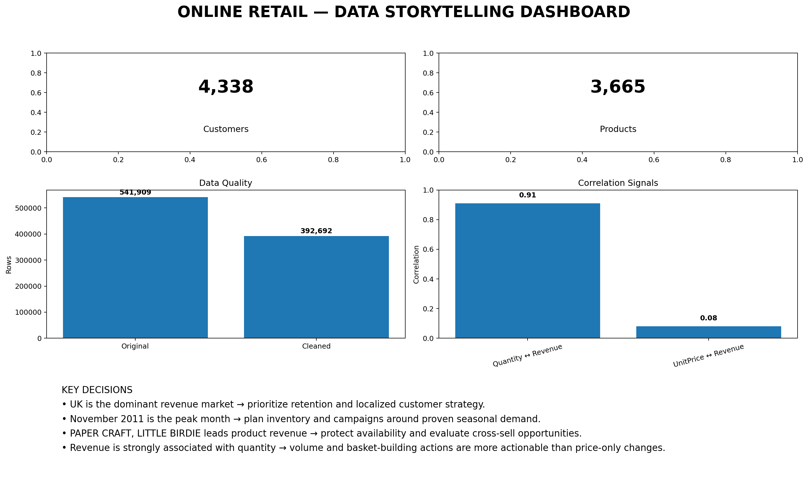
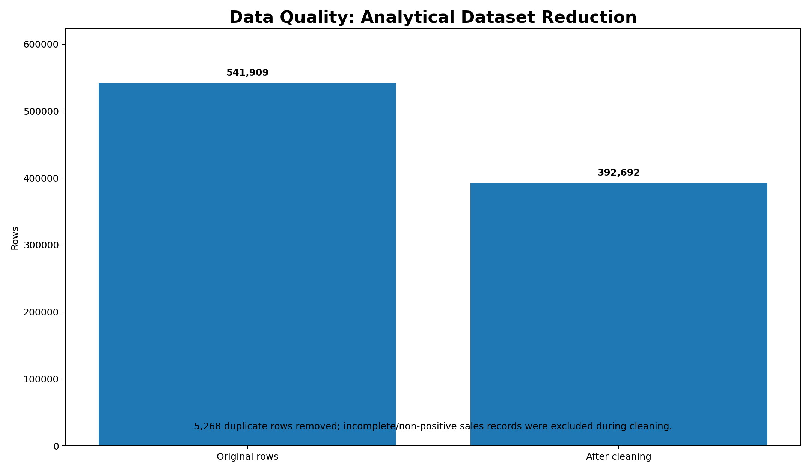
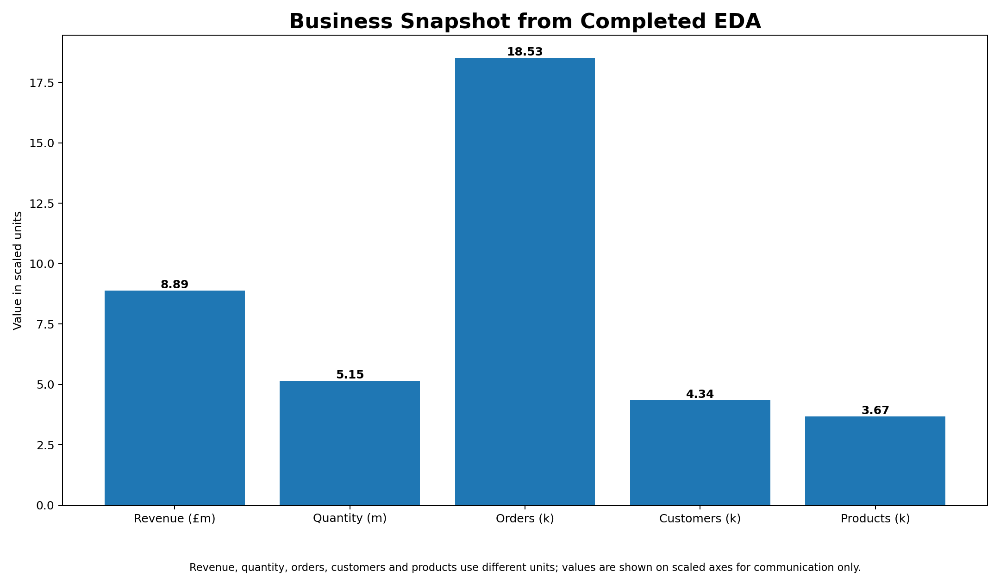
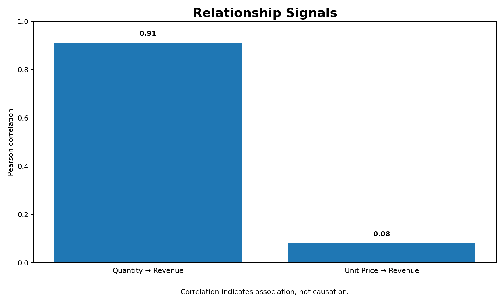

# 📊 Data Storytelling — Online Retail

## Internship Task 2

> **From raw transactions to business decisions:** a visual data story covering data quality, business performance, patterns, insights, and actionable recommendations.

This project analyzes the **UCI Online Retail** transaction dataset using Python and turns the analysis into a decision-oriented report and dashboard.

---

## ✨ Project Highlights

| Area | What this project delivers |
|---|---|
| 🧹 Data Quality | Duplicate, missing, invalid and non-positive sales records handled |
| 📈 Business Metrics | Revenue, quantity, orders, customers, products and AOV |
| 🔎 Pattern Analysis | Monthly trends, countries, products and relationships |
| 📊 Visual Story | Dashboard + analytical charts |
| 💡 Decisions | Business interpretation and actionable recommendations |
| 📄 Report | Professional internship report in PDF format |

---

## 🖼️ Project Preview

### Final Dashboard



### Data Quality & Business Snapshot

| Data Quality | Business Snapshot |
|---|---|
|  |  |

### Relationship Signals



---

## 🎯 Business Questions

The project focuses on practical questions such as:

- How clean and reliable is the transaction data?
- What is the overall revenue and sales performance?
- Which countries generate the most revenue?
- Which products contribute the most revenue?
- How does revenue change over time?
- Does quantity sold have a strong relationship with revenue?
- What actions could improve retention, planning and product availability?

---

## 📌 Key Findings

The verified results from the completed analysis show:

- **541,909** original records across **8 columns**.
- **5,268** duplicate rows were removed.
- Final analytical dataset: **392,692 rows × 14 columns**.
- Missing values after cleaning: **0**.
- Total revenue: **£8,887,208.89**.
- Quantity sold: **5,152,002**.
- Orders: **18,532**.
- Customers: **4,338**.
- Products: **3,665**.
- Average order value: **£479.56**.
- Quantity–Revenue correlation: approximately **0.91**.
- UnitPrice–Revenue correlation: approximately **0.08**.
- **UK** is the dominant revenue-generating country.
- **November 2011** is the highest-revenue month in the analyzed period.
- **PAPER CRAFT, LITTLE BIRDIE** is the highest-revenue product.

---

## 🔄 Analysis Workflow

```text
UCI Online Retail Dataset
          ↓
Data Cleaning & Validation
          ↓
Feature Engineering
          ↓
Business Metrics
          ↓
Exploratory Analysis
          ↓
Visual Storytelling
          ↓
Insights & Recommendations
          ↓
Final Dashboard + PDF Report
```

---

## 🛠️ Technologies Used

- **Python**
- **Pandas** — data cleaning and analysis
- **NumPy** — numerical operations
- **Matplotlib** — visualization
- **Seaborn** — statistical visualization
- **OpenPyXL** — Excel dataset loading
- **ReportLab** — PDF report generation

---

## 📁 Project Structure

```text
Data-Storytelling-Report/
│
├── 📁 data/
│   └── README.txt
│
├── 📁 docs/
│   └── Data_Storytelling_Report.pdf
│
├── 📁 outputs/
│   ├── 📁 charts/
│   ├── final_eda_dashboard.png
│   ├── cleaned_online_retail.csv
│   └── analysis_summary.txt
│
├── 📁 screenshots/
│   ├── 01_data_quality.png
│   ├── 02_business_snapshot.png
│   ├── 03_relationship_signals.png
│   └── 04_final_dashboard.png
│
├── 📁 src/
│   └── data_storytelling.py
│
├── README.md
├── requirements.txt
├── demo_video_script.txt
└── SUBMISSION_CHECKLIST.txt
```

> **Dataset note:** The raw Excel dataset is intentionally not included in this repository. Download it from the official UCI source and place it at `data/online_retail_II.xlsx` before running the pipeline.

---

## ▶️ Run Locally

### 1. Create a virtual environment

```bash
python -m venv .venv
```

### 2. Activate it

**Windows**

```bash
.venv\Scripts\activate
```

**macOS/Linux**

```bash
source .venv/bin/activate
```

### 3. Install dependencies

```bash
pip install -r requirements.txt
```

### 4. Add the dataset

Download the legally sourced Excel file from the official UCI repository and place it here:

```text
Data-Storytelling-Report/data/online_retail_II.xlsx
```

### 5. Run the project

```bash
python src/data_storytelling.py
```

The script generates the cleaned dataset, analytical charts, summary metrics and final dashboard inside `outputs/`.

---

## 📄 Internship Report

The complete professional report is available here:

**[Open Data Storytelling Report PDF](docs/Data_Storytelling_Report.pdf)**

The report covers:

- Executive summary
- Business questions
- Dataset and legal data use
- Methodology
- Data quality
- Business metrics
- Key findings
- Decision-oriented interpretation
- Recommendations
- Limitations
- Tools and external resources

---

## 💡 Business Recommendations

1. **Strengthen UK customer retention** because the UK is the dominant revenue market.
2. **Prepare inventory and campaigns ahead of the Sep–Nov period**, with special attention to the November peak.
3. **Promote high-revenue products and relevant cross-sells** to increase basket value.
4. **Use customer segmentation** for targeted retention and repeat-purchase campaigns.
5. **Rerun the analysis periodically** to detect changes in products, markets and seasonality.

---

## ⚠️ Data Quality & Limitations

For sales-performance analysis, the pipeline removes duplicates, incomplete customer/product records and rows with non-positive quantity or price. Therefore, cancellations/returns and incomplete customer records are not represented in the final sales-performance view.

Correlation results are descriptive and **do not establish causation**.

---

## 📚 Dataset & Resources

### UCI Online Retail Dataset

- **Repository:** UCI Machine Learning Repository
- **License:** CC BY 4.0
- **DOI:** 10.24432/C5CG6D
- **Official source:** https://archive.ics.uci.edu/dataset/502/online%2Bretail

### Learning / Documentation Resources

- Python
- Pandas documentation
- Matplotlib documentation
- Kaggle Learn

No passwords, API keys, tokens, private credentials, or sensitive personal information are included.

---

## 🔗 Related Project

This Task 2 project extends the earlier EDA work:

**Task 1 — EDA Dashboard:**
https://github.com/rahulraj2007k-pixel/EDA-Dashboard

---

## 👨‍💻 Project Author

**Rahul Kumar**

**Internship Task 2 — Data Storytelling Report**

